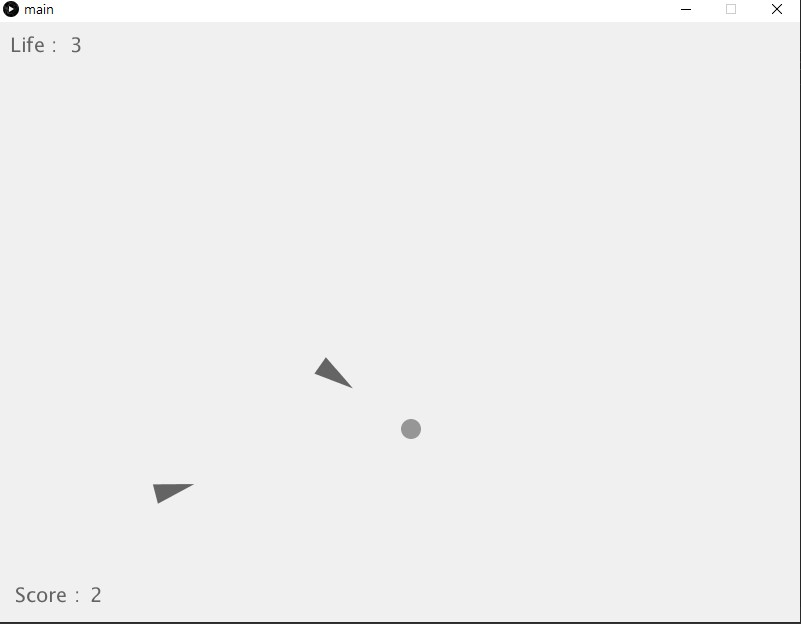
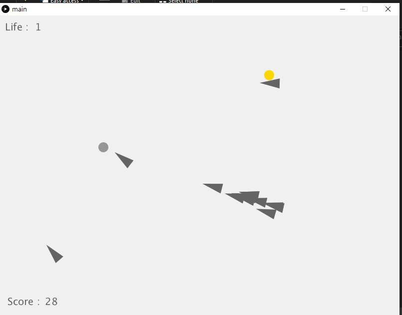
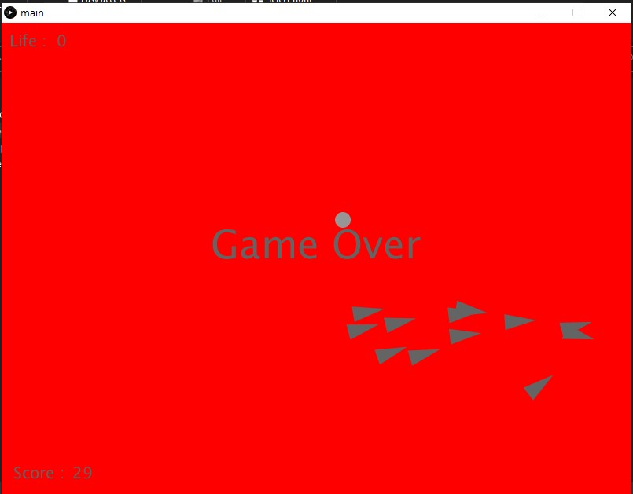

# Seek-And-Steer-Processing
You are a dot chased by crazy triangles spawning every second!

## Prerequisite
1. [Processing 3](https://processing.org/)

## Running
1. Open `main/main.pde` using Processing
2. Press Run or `ctrl+R`

## How to Play
- Move using your mouse.
- Dodge the triangles, survive as long as you can, you have 3 lives.

## Acknowledgement
I know this game is too easy.

I made this game to learn how to implement seek and steer behavior on Autonomous Agent

Next project is going to be flocking behavior